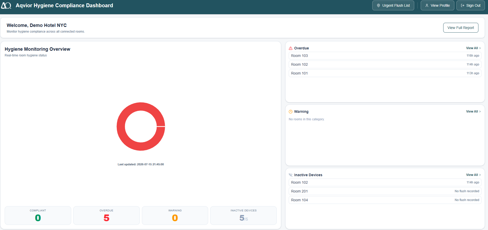
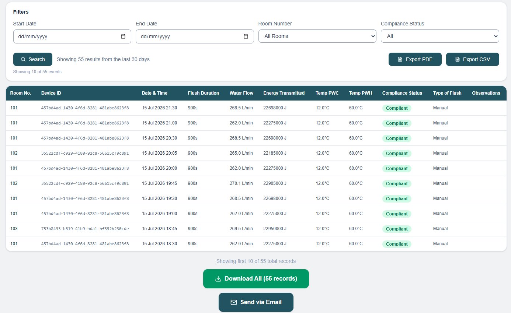
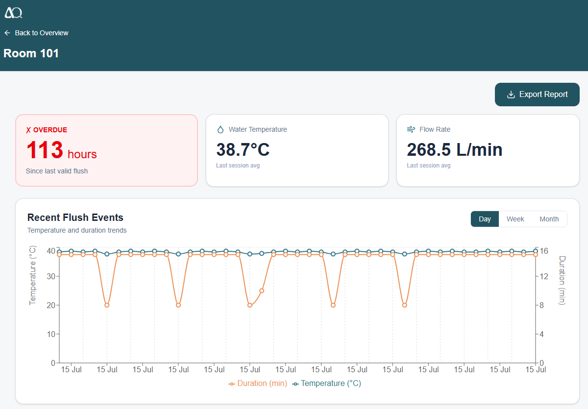
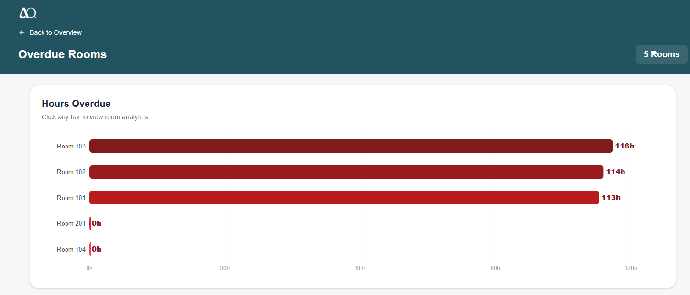
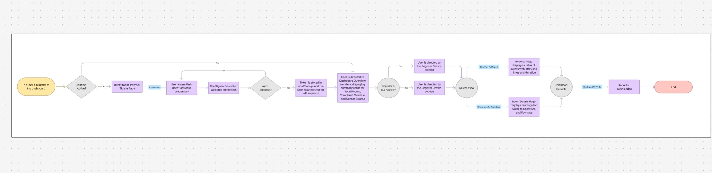

# Aqvior Hygiene Compliance Dashboard

**Portfolio Case Study · Chinelo Lydia Nweke · Furtwangen University IBS6 · Summer Semester 2026**

---

## Project Overview

Aqvior is a German IoT startup building a real-time hygienic flushing compliance platform for the hospitality industry. Their system helps hotels meet the **VDI 6023 standard**, a German health regulation standard for hygienic flushing intervals.

Before this system, hotel maintenance teams tracked compliance manually through spreadsheets, paper checklists, and room-by-room inspections. For a large property this is time-consuming and error-prone, and leaves no auditable record for health authority inspections.

The goal of this project was to deliver a web-based dashboard giving hotel staff and property managers a real-time overview of compliance status across all connected rooms, alert them to rooms approaching non-compliance before it becomes critical, and generate compliant reports in seconds.

---

## My Role

I served as one of two **Frontend Developers** on the project and the **sole UX/UI Designer**, responsible for designing and implementing the entire React single-page application that hotel staff interact with daily.

---

### UX and UI Design

I was solely responsible for all user experience and interface design decisions on the project. This included defining the information hierarchy across every page, designing the layout and component structure, and creating a consistent visual language that prioritizes compliance-critical information.

Design work included:

- Translating client requirements and stakeholder feedback into wireframes and interface concepts using Figma prompts and design specifications.
- Designing a compliance-first dashboard layout that surfaces critical rooms at a glance, without requiring staff to navigate or search.
- Defining the visual encoding system used across the application: red for overdue, amber for warning, green for compliant, and grey for inactive devices, applied consistently across all charts, cards, and status indicators.
- Designing responsive page layouts that work across standard office monitors and large display setups.
- Iterating on the interface continuously based on direct feedback from the client and end users throughout the project.

---

### Pages and Features Built

**Authentication**

- **Login Page** - Designed and built the credential form for both hotel property accounts and admin accounts. Handles JWT token storage on successful login, forces a password change when the backend requires it, and implements role-based access control.
- **Change Password Page** - Enforced on first login before any other page is accessible. Validates the current password, new password, and confirmation fields before submitting to the API.

**Main Application**

- **Dashboard** - Main compliance overview page with a real-time donut chart showing compliant, overdue, and warning room counts, status count tiles, and three room-category cards surfacing the most urgent compliance issues at a glance.
- **Compliance Report Page** - An 11-column report table matching the VDI 6023 health authority format, with date and room filters, CSV export, in-browser PDF generation, and a monthly email delivery subscription feature.
- **Room Analytics Page** - Individual room detail view showing compliance status with hours remaining or elapsed, a flush history line chart with day, week, and month filters, water temperature and flow rate metrics, and a timestamped event log.
- **Overdue Rooms Detail** - Full list of all overdue rooms visualised as a horizontal bar chart, sorted by hours overdue with the most critical room at the top. Each bar is clickable and navigates to the room analytics page.
- **Warning Rooms Detail** - Same structure as the overdue page, sorted by hours remaining before non-compliance, with the most urgent room at the top.
- **Sensor Error Rooms Detail** - Inactive devices breakdown page showing rooms where the sensor is offline, deactivated by an admin, or has never sent data. Includes overview stat cards per sub-category.
- **Urgent Flush Map** - Focused view listing all overdue and warning rooms for on-site staff who need a quick printed reference for which rooms require immediate attention.
- **User Profile Page** - Read-only page showing the authenticated property account's information including property name, property ID, address, contact name, username, role, and account creation date.

**Administration**

- **Admin Panel** - Management interface accessible only to admin accounts. Provides full create, update, and delete operations for properties and sensor devices, and allows admins to reset passwords for property accounts.
- **Add Device Page** - Form for registering a new sensor device to a property, feeding directly into the device management side of the system.

---

### Software Requirements Documentation

As part of the formal project documentation, I contributed to the specification and documentation of software requirements for the frontend system. This included:

- Defining and documenting functional requirements for each page and feature, mapping them to the agreed client needs and VDI 6023 compliance obligations.
- Documenting non-functional requirements covering performance expectations, browser compatibility, display scaling behaviour, session security (idle timeout and JWT handling), and accessibility considerations.
- Maintaining traceability between requirements and the implemented features to support the final handover and validation process.

---

### Handover Documentation

I authored the complete frontend handover documentation package to ensure the client and any incoming developer could take ownership of the codebase without requiring knowledge transfer sessions. The documentation package included:

- **Technical README** - A senior-engineer-level project README covering the full tech stack, folder structure, architecture overview, data flow, routing and access control table, authentication flow, environment variable configuration, and a troubleshooting guide.
- **Frontend Codebase Documentation (Word document)** - A formal handover document structured for non-technical stakeholders and future developers alike. Covered the project overview, technology stack, page structure and feature list, component hierarchy, API integration patterns, and instructions for extending or modifying the dashboard.

---

### Validation and Testing

I produced and maintained a validation checklist to verify that all implemented features met the original requirements before handover. The checklist covered:

- Feature-by-feature verification against the agreed functional requirements.
- Cross-browser testing (Chrome and Safari) for layout consistency.
- Display scaling validation across standard 1080p screens and large monitor setups.
- Export functionality verification for CSV and PDF outputs.
- Authentication flow testing including first-login forced password change, idle timeout logout, and role-based access control.
- API connectivity testing confirming correct request paths and error handling in the production environment.

---

### Stakeholder Feedback Implementation

Throughout the project I was the primary point of contact for incorporating client feedback into the frontend. This was an ongoing process across the full project duration and included:

- Adjusting the dashboard layout to make use of the full screen width after the client reported that the interface felt narrow on their display.
- Standardising button sizes on the Reports page after the client noted visual inconsistency between the export controls.
- Investigating and resolving the large monitor display issue after the client reported needing to manually zoom the browser to 150% for the dashboard to fill the screen on their office setup.
- Updating the browser tab title and favicon to reflect the Aqvior brand after the client requested that the product feel more polished in the browser.
- Iterating on page layouts and visual hierarchy based on feedback gathered during client review sessions throughout the semester.

---

### Additional Technical Contributions

- **Display Scaling Fix** - Diagnosed and resolved a layout issue where the dashboard did not fill the screen on large monitors running at 100% OS display scaling. Implemented CSS media query zoom rules to ensure the interface scales correctly across display configurations.
- **Production API Fix** - Identified and resolved a production login failure caused by the built JavaScript bundle missing the `/api/v1` path prefix, which sent all API requests to the wrong server path. Updated the Vite build configuration to inject the correct API base URL.
- **Favicon and Browser Branding** - Created the Aqvior-branded favicon (brand teal background with white logo) and updated the browser tab title from the Vite default to "Aqvior Dashboard."
- **Code Quality** - Reviewed and cleaned all inline comments across every page file, removing stale fix notes and keeping only comments that explain non-obvious behaviour or domain-specific constraints.

---

## Team and Context

This project was completed as part of the **IBS6 Software Project** module at **Furtwangen University**, Summer Semester 2026, in partnership with the Aqvior startup client. The project was supervised by university faculty and sponsored by the Aqvior team.

| Name | Role |
|---|---|
| Juliana Oliveira Cerqueira | Project Lead / Backend and Data Ingestion |
| Ly Le | AWS Infrastructure / API |
| Marveen Renard Reyes | Database |
| **Chinelo Lydia Nweke** | **Frontend Developer / UX and UI Designer** |
| Hacer Yagmur | Frontend Developer |

---

## Tech Stack

**Frontend**
- React 19
- Vite 8
- Tailwind CSS 4
- React Router DOM 7
- Recharts (donut chart, bar charts, line chart)
- jsPDF and jspdf-autotable (in-browser PDF generation)
- Lucide React (icon library)

**Backend and Infrastructure**
- FastAPI (Python REST API)
- PostgreSQL (database)
- AWS EC2 (hosting)
- nginx (reverse proxy and static file server)

**Design**
- Figma (UX wireframing and UI design)

**IoT / Hardware**
- Sensor devices installed per room, transmitting flush event data (timestamp, temperature, flow rate, duration) to the backend over the network.

---

## Architecture Overview

The system is made up of three layers that work together end to end.

**IoT Sensor Layer**
Physical sensor devices are installed in each hotel room. When a flush event occurs, the sensor records the timestamp, water temperature, flow rate, and duration, and transmits this data to the backend over the network.

**Backend API Layer**
A FastAPI application running on AWS EC2 receives sensor data, stores it in a PostgreSQL database, and exposes a REST API consumed by the frontend. The API handles authentication, room and device management, and generates compliance calculations based on the configurable VDI 6023 standard intervals.

**Frontend Layer**
The React single-page application connects to the backend API over HTTPS. It fetches the current compliance state of all rooms on load and provides the interface for monitoring, filtering, exporting reports, and managing devices.

**Data Flow**

```
IoT Sensor > FastAPI Backend > PostgreSQL > REST API > React Frontend > Staff Browser
```

---

## Screenshots and Diagrams

### Dashboard Overview


### Compliance Report Page


### Individual Room Analytics


### Overdue Rooms Drill-Down


### System Architecture Diagram


---

## Key Contributions and Outcomes

- Hotel staff can see the real-time compliance status of every room at a glance, replacing manual room-by-room checks.
- Overdue and at-risk rooms surface immediately on the dashboard so staff can act before a health authority inspection.
- The compliance report matches the exact column format required for VDI 6023 inspections, replacing a previously manual documentation process.
- PDF and CSV exports allow property managers to generate and submit compliance evidence in seconds.
- A complete handover documentation package ensures the client and future developers can maintain and extend the system without requiring knowledge transfer from the original team.
- The display scaling fix unblocked the client, who was unable to use the dashboard on their large office monitor without manually adjusting browser zoom.
- The production API fix restored login access for all users after a deployment environment issue caused requests to be routed to the wrong server path.
- Continuous integration of stakeholder feedback throughout the project ensured the final product closely matched client expectations and real-world usage patterns.

---

## Note on Confidentiality

This repository is a documentation-only portfolio overview created to describe my contribution to the Aqvior project. It does not contain any source code, configuration files, environment variables, API credentials, or proprietary data from the client. For access to the full codebase, please contact the Aqvior team directly.
